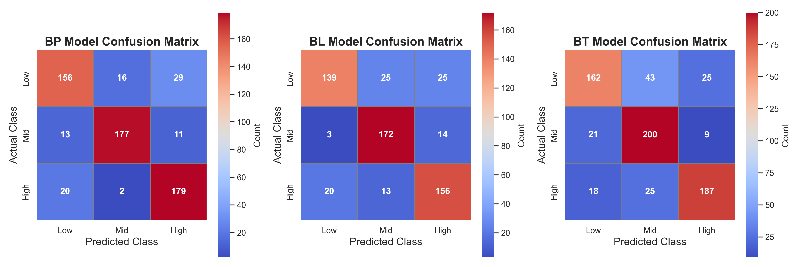
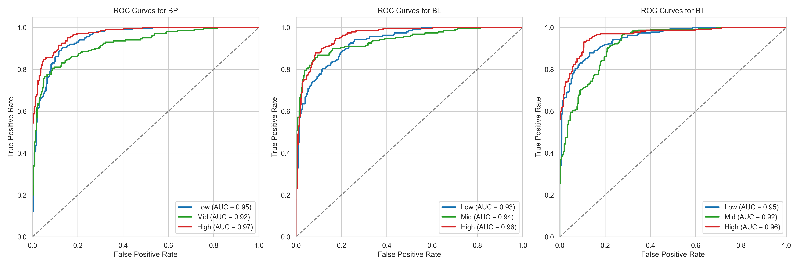

# Classification Brand Perception Using Random Forest: Brand Preference (BP), Brand Loyalty (BL) and, Brand Trust (BT) 

  
  
  
  

  

## About the Project  
Brands enable strategy development, competitive advantage, and audience connection in modern society. This repository contains the code and resources from my research paper “Classification of Brand Perception Using Random Forest: Brand Preference, Brand Loyalty, and Brand Trust” presented at IDSSC’24 and published in the Proceedings Book. The study analyzes data from Ankara Hacı Bayram Veli University (Spring 2023/2024) to investigate how university students’ brand preference, loyalty, and trust can be modeled using Random Forest classification and decision tree classifiers, supported by a meta-predictor to reduce overfitting. Addressing class imbalance with SMOTE, the research employs the Brand Perception Scale with 22 independent variables—including demographics, income, fashion, design, and social media engagement—to assess BP, BL, and BT.

## Key Highlights  
- **Algorithm:** Random Forest (multi-class classification)  
- **Data Handling:** Class imbalance solved with SMOTE  
- **Sample Size:** 407 undergraduate students  
- **Variables:** 22 predictors including demographics, income, brand monitoring, social media use  
- **Evaluation Metrics:** Accuracy, Precision, Recall, F1-score  
- **Findings:**  
  - Social media, fashion, and design strongly affect **brand preference**  
  - Design, online shopping, and product recency drive **brand loyalty**  
  - Trust is influenced by online shopping, recognizability, and income  

## Visualizations  

Decision trees, feature importance plots, confusion matrices, and ROC curves were generated to illustrate how independent variables shape **brand perception constructs (BP, BL, BT)**.  

### Decision Tree Example  

  

  

### Confusion Matrices  

  

  

### ROC Curves  

  

  
 
 

## Citation  
If you use this repository, please cite the paper:  

**Yılmaz, M. İ., Yıldız, Ö., & Gökmen, Ş. (2024).**  
*Classification of Brand Perception Using Random Forest: Brand Preference, Brand Loyalty, and Brand Trust.*  
In **Proceedings of the International Data Science and Statistics Conference (IDSSC’24)**,  
Turkish Statistical Association, Ankara Hacı Bayram Veli University.  
ISBN: 978-625-95613-0-1  

## License  
This work is licensed under a **Creative Commons Attribution-NonCommercial-NoDerivatives 4.0 International License**.  
See the [LICENSE](LICENSE) file for details.  

---
